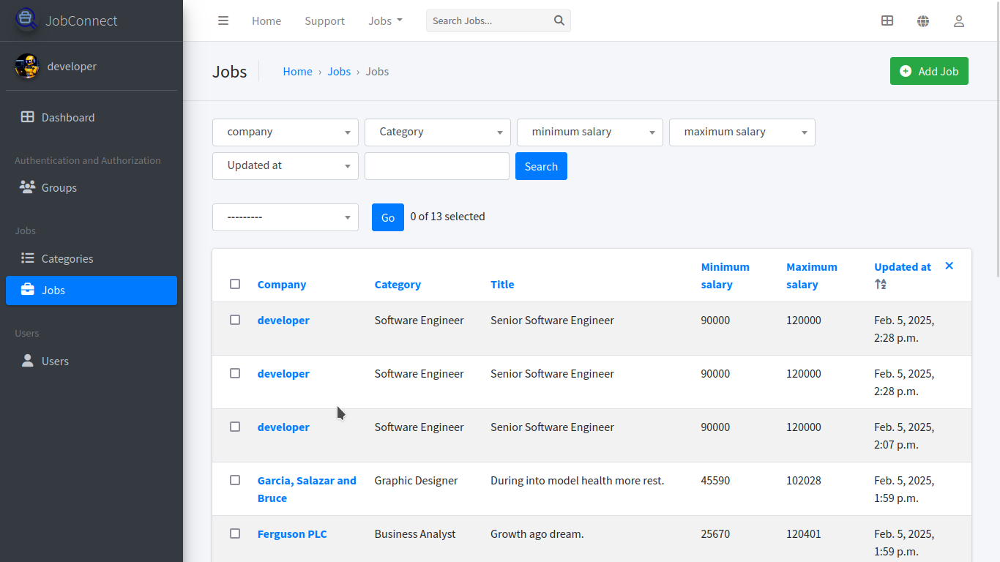
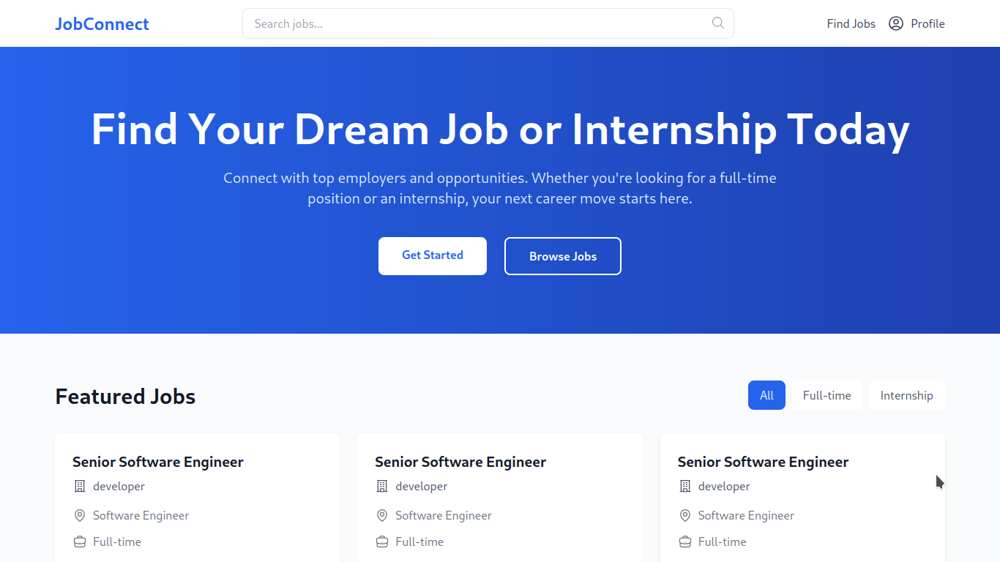

# JobConnect
Find your dream job or internship today.

## Demo

| Admin | Client |
|-------|--------|
|  |  |

## Technologies

- [FastAPI](https://fastapi.tiangolo.com/)
- [Django](https://www.djangoproject.com/)
- [Vite](https://vitejs.dev/)

## Installation & Setup

### Prerequisites

- [x] [Python >= 3.12](https://python.org)
- [x] [Node.js >= 18.19.0](https://nodejs.org/)
- [x] [Git](https://gith)

> [!NOTE]
> These instructions presume you're using a *nix system.

### Clone the Repository

First, clone the repository and enter the project directory:

```sh
git clone https://github.com/Simatwa/JobConnect.git
cd JobConnect
```

### Setup Backend

Navigate to the backend directory and run the setup commands:

```sh
cd backend
make install setup fake developmentsuperuser
```

### Setup Frontend

Navigate to the frontend directory and run the setup commands:

```sh
cd ../frontend
make install build
```

## Running the Server

To start the server, navigate back to the backend directory and run the server:

```sh
cd ../backend
make runserver
```

> [!WARNING]
> The site is under active development, so it might be buggy.


## Miscellaneous

| Endpoint    |  URL          |
|-------------|---------------|
| API docs    | `/api/docs`   |
| API Redocs  | `/api/redoc`  |
| Admin       | `/d/admin`    |

### Superuser credentials

| Username    | Password    |
|-------------|-------------|
| development | developer   |


## Contributing

We welcome contributions! Please fork the repository and create a pull request with your changes.

## License

This project is licensed under the MIT License. See the [LICENSE](LICENSE) file for more details.

